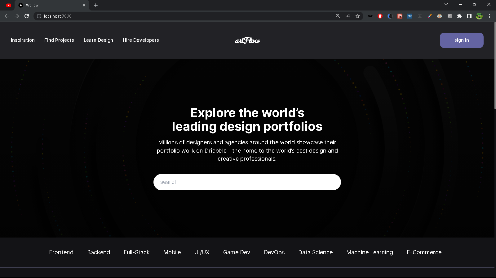
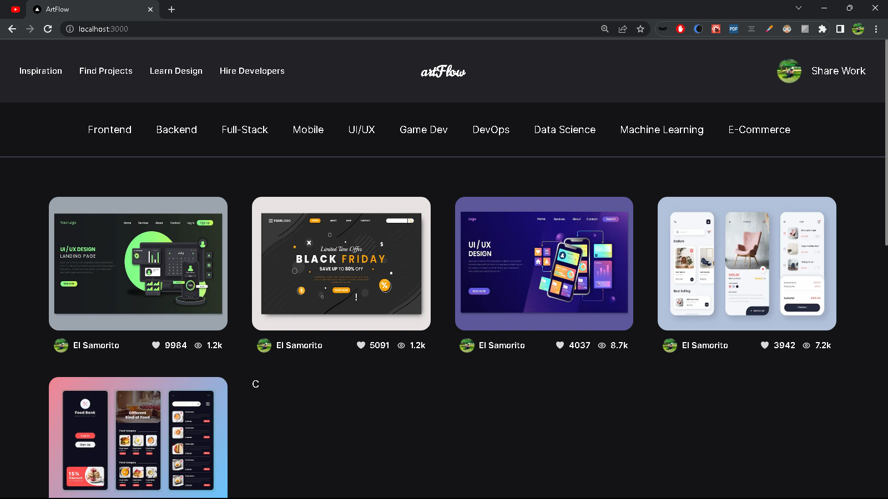
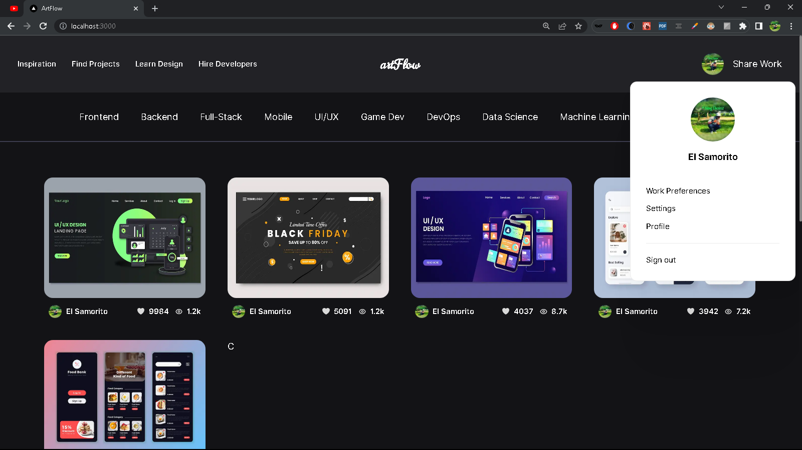
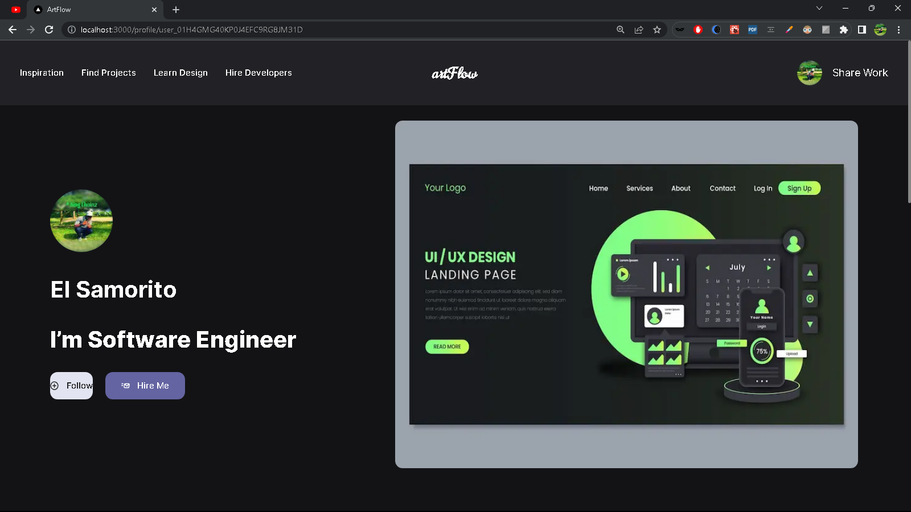
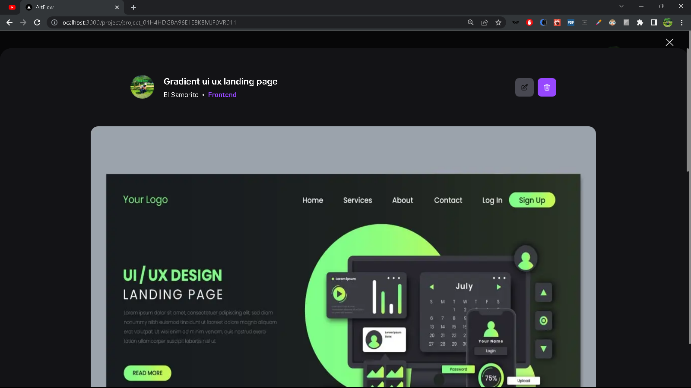
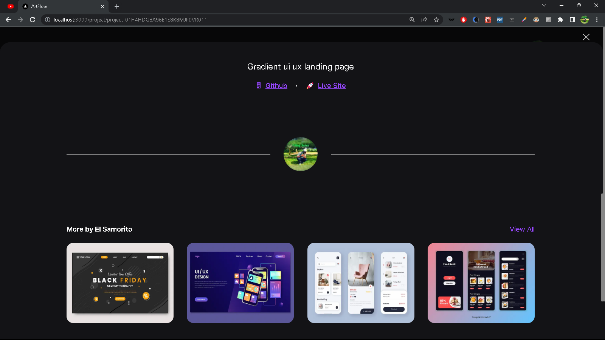
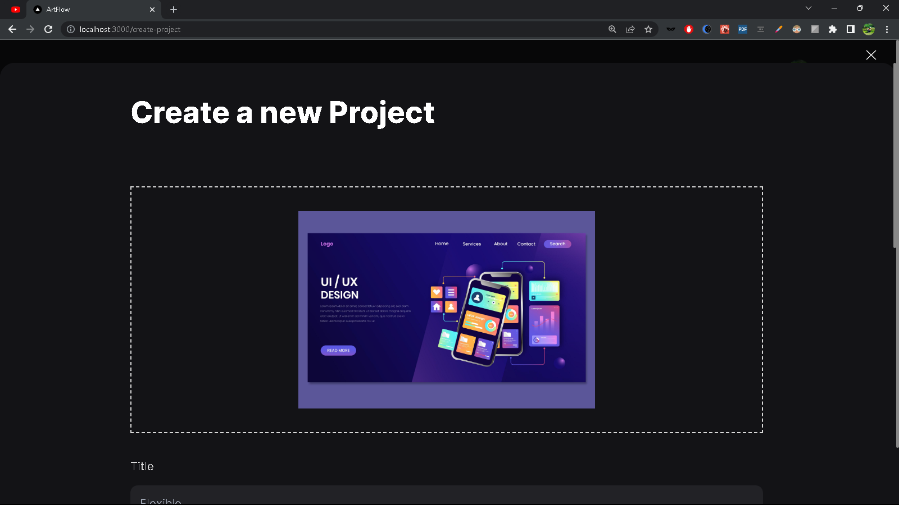
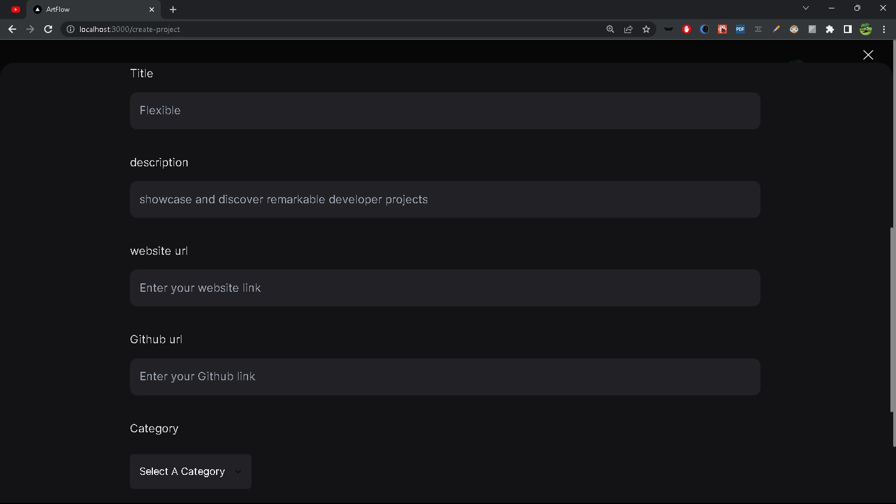

# Artflow Project (Dribbble Clone)

## Description

artflow Project is a dark version of Dribbble, a popular platform for designers to showcase their work. This project was built as a means for me to learn Next.js 13, a powerful React framework, and enhance my understanding of web development concepts through hands-on experience.

Building this project proved to be a rewarding challenge, especially when it came to working with GraphQL and Graphbase. By immersing myself in the development process, I was able to gain a deeper understanding of these technologies and solidify my knowledge.

## Technologies Used

- **Next.js 13:** A React framework that provides server-side rendering and other powerful features to build scalable web applications.
- **Tailwind CSS:** A utility-first CSS framework that allowed for rapid UI development and customization.
- **GraphQL with Graphbase:** Initially, the project utilized Graphbase for the database. However, I am planning to transition to Superbase to further improve the project's functionality and data management capabilities.

## Features

- Browse and explore a dark-themed interface for showcasing design work.
- Discover and engage with various design projects posted by users.
- Interact with the user community by liking, commenting, and sharing projects.
- Smooth navigation and intuitive user experience.

## Screenshots

## Installation

To run the artflow Project locally, please follow these steps:

1. Clone the repository: `git clone https://github.com/your-username/artflow-project.git`
2. Navigate to the project directory: `cd artflow-project`
3. Install the dependencies: `npm install`
4. Start the development server: `npm run dev`
5. Open your browser and visit `http://localhost:3000`

## Contributing

Contributions to the Artflow Project are welcome! If you would like to contribute, please follow these steps:

1. Fork the repository.
2. Create a new branch: `git checkout -b feature/your-feature`
3. Make your changes and commit them: `git commit -m 'Add your feature'`
4. Push to the branch: `git push origin feature/your-feature`
5. Open a pull request, and describe the changes you've made.

## License

This project is licensed under the [MIT License](https://opensource.org/licenses/MIT). Feel free to use, modify, and distribute the code as you see fit.

## Contact

If you have any questions or suggestions regarding the Artflow Project, feel free to reach out to me at [your-email@example.com](mailto:your-email@example.com). I would be happy to hear from you!

Thank you for your interest in the Artflow Project. Enjoy exploring and learning!
